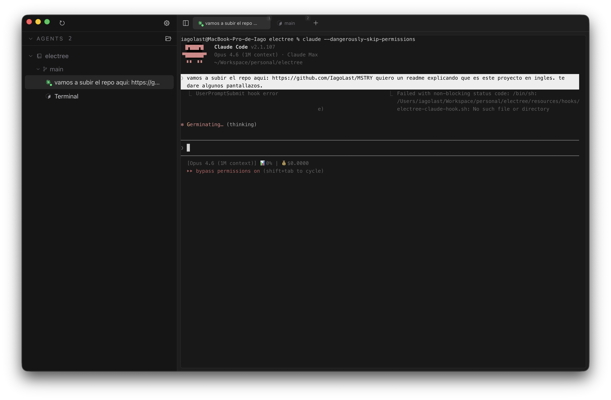
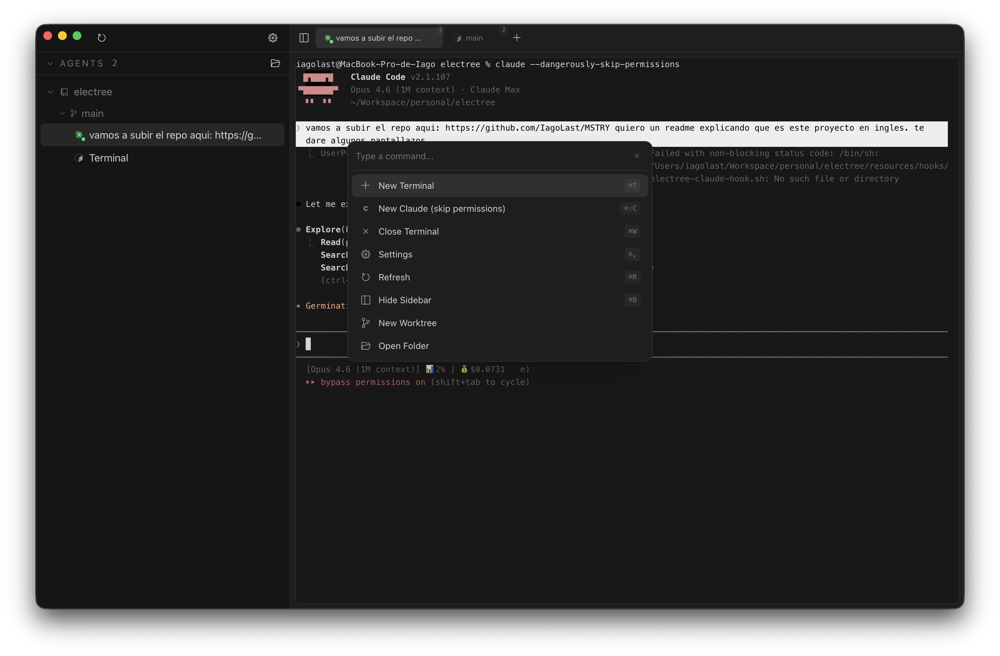
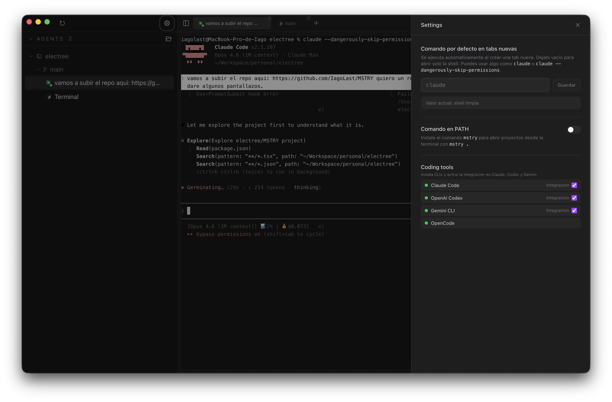

# MSTRY

A terminal with superpowers for orchestrating AI agents across your projects.



## The problem

As a developer you work on multiple projects simultaneously, and within each project you often run several AI agents in parallel — each on its own git branch so they don't step on each other. Managing all of this with plain terminal windows and manual `git worktree` commands gets messy fast.

## The idea

MSTRY organizes your work in a simple hierarchy:

```
Project
└── Worktree (git branch in isolation)
    └── Agent (independent terminal)
```

- **Project** — a git repository you're working on.
- **Worktree** — a git worktree linked to its own branch, so multiple agents can work on the same repo without conflicts.
- **Agent** — an independent terminal session running inside a worktree. This is where you launch `claude`, `codex`, `aider`, or any CLI agent.

You can have N projects, each with M worktrees, each with K terminal tabs — all managed from a single window.

## Features

- **Git worktree management** — Create, switch, and delete worktrees from the sidebar without leaving the app.
- **Persistent terminal sessions** — Each tab runs inside a tmux session that survives app restarts. Reopen MSTRY and pick up where you left off.
- **AI agent detection** — Automatically detects Claude Code, OpenAI Codex, Gemini CLI, and OpenCode processes running in your terminals and shows their status (working / idle) in the tab bar.
- **Command palette** — Quick access to all actions via `Cmd+K`.
- **Multi-project support** — Add multiple repositories and switch between them. Drag to reorder.
- **Configurable defaults** — Set the default command for new tabs (e.g. `claude` to auto-launch an agent on every new tab).
- **`mstry` CLI** — Optionally install a CLI command to open projects from your terminal.





## Keyboard shortcuts

| Shortcut | Action |
|----------|--------|
| `Cmd+K` | Command palette |
| `Cmd+T` | New terminal tab in current worktree |
| `Cmd+B` | Toggle sidebar |
| `Cmd+W` | Close current terminal tab |

## Tech stack

- [Electron](https://www.electronjs.org/) + [electron-vite](https://electron-vite.org/) — desktop shell
- [React 19](https://react.dev/) + [TypeScript](https://www.typescriptlang.org/) — UI
- [xterm.js](https://xtermjs.org/) + [node-pty](https://github.com/microsoft/node-pty) — real terminal emulation
- [tmux](https://github.com/tmux/tmux) — session persistence
- [Tailwind CSS v4](https://tailwindcss.com/) — styling

## Getting started

### Prerequisites

- Node.js
- tmux (`brew install tmux` on macOS)

### Development

```bash
npm install
npm run dev
```

### Build

```bash
npm run dist
```

The packaged app will be in the `release/` directory.

## How it works

1. Open a project folder (it auto-detects if it's a git repo).
2. If it's a git repo, the sidebar shows all existing worktrees.
3. Create new worktrees from the sidebar — MSTRY runs `git worktree add` with a new branch for you.
4. Select a worktree to open terminal sessions rooted in that directory.
5. Open multiple terminal tabs per worktree (`Cmd+T`) to run agents in parallel.
6. Delete worktrees when done — MSTRY cleans up the worktree folder, prunes Git metadata, and deletes the linked local branch.

## License

MIT
